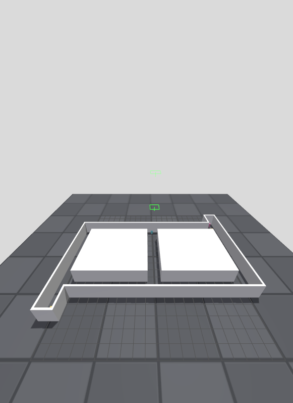
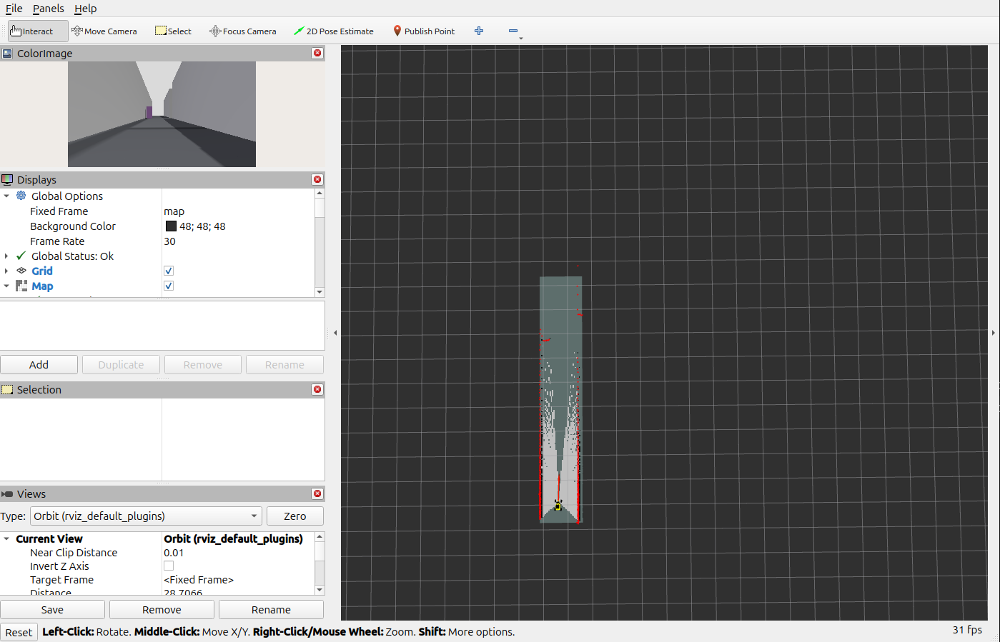
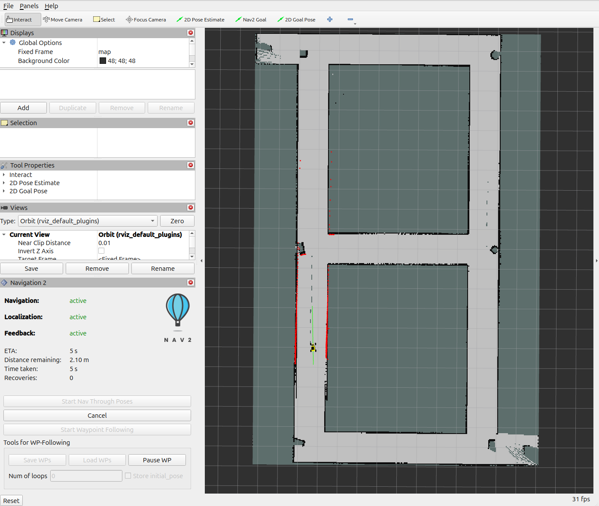

# Thundercar Host

This repository is the **first** in a series for the **Thundercar** hobby project — a small Ackermann car that we want to drive, map, and eventually navigate on its own.

## What this repo is for

The goal here is to get the **simulation** as far as we can before leaning on the physical robot. If sim is solid, we can:

- develop and debug navigation safely
- iterate on worlds, maps, and controllers quickly
- eventually **train AI** so the car can move around at **high speed without falling apart**

Everything in this workspace runs in **Gazebo Harmonic** with **ROS 2 Jazzy**, using the same topic and frame names as the real robot. Work done here should transfer cleanly later.

### Related repos (coming / elsewhere)

| Piece | Where |
|-------|--------|
| **This repo** — Gazebo sim, SLAM, Nav2 | `thundercar_host` (you are here) |
| **Bill of materials** for the physical robot | separate repository |
| **UI** — connect to nodes/topics and talk to robots without drowning in ROS complexity | separate repository — wait for it |

The physical robot software lives under `thundercar_ws/software`. Treat that tree as read-only from here; do not edit it from this repo.

## Screenshots



*Gazebo: the lvl16 figure-8 corridor with Thundercar spawned.*



*RViz during SLAM: building the occupancy map while you drive.*



*RViz with Nav2: localized on the saved map, driving to a goal.*

---

## Setup (once)

| | Physical robot | This host |
|---|---|---|
| OS | Ubuntu 22.04 (Jetson) | Ubuntu 24.04 |
| ROS | Humble | **Jazzy** (official pair with Gazebo Harmonic) |

### Install deps

```bash
# 1) ROS 2 Jazzy — https://docs.ros.org/en/jazzy/Installation/Ubuntu-Install-Debs.html
sudo apt update && sudo apt install locales
sudo locale-gen en_US en_US.UTF-8
sudo update-locale LC_ALL=en_US.UTF-8 LANG=en_US.UTF-8
export LANG=en_US.UTF-8

sudo apt install software-properties-common
sudo add-apt-repository universe
sudo apt update && sudo apt install curl -y
sudo curl -sSL https://raw.githubusercontent.com/ros/rosdistro/master/ros.key \
  -o /usr/share/keyrings/ros-archive-keyring.gpg
echo "deb [arch=$(dpkg --print-architecture) signed-by=/usr/share/keyrings/ros-archive-keyring.gpg] http://packages.ros.org/ros2/ubuntu $(. /etc/os-release && echo $UBUNTU_CODENAME) main" \
  | sudo tee /etc/apt/sources.list.d/ros2.list > /dev/null

sudo apt update
sudo apt install ros-jazzy-desktop python3-colcon-common-extensions python3-rosdep

# 2) Gazebo Harmonic + ros_gz
sudo apt install \
  ros-jazzy-ros-gz \
  ros-jazzy-ros-gz-sim \
  ros-jazzy-ros-gz-bridge \
  ros-jazzy-ackermann-msgs \
  ros-jazzy-joy \
  ros-jazzy-joy-teleop \
  ros-jazzy-depth-image-proc \
  ros-jazzy-xacro \
  ros-jazzy-robot-state-publisher \
  ros-jazzy-joint-state-publisher \
  ros-jazzy-rviz2

# 3) Mapping + navigation packages
sudo apt install \
  ros-jazzy-slam-toolbox \
  ros-jazzy-nav2-map-server \
  ros-jazzy-navigation2 \
  gz-harmonic
```

In **every** new terminal:

```bash
source /opt/ros/jazzy/setup.bash
```

> Do **not** use Humble on this machine — it is not available on Ubuntu 24.04.

### Build this workspace

```bash
cd /path/to/thundercar_host
source /opt/ros/jazzy/setup.bash
colcon build --symlink-install
source install/setup.bash
```

### Sanity: just drive the sim

```bash
source /opt/ros/jazzy/setup.bash
source install/setup.bash
ros2 launch tc_gazebo sim_lvl16.launch.py
```

A keyboard teleop window should open (`w`/`s` speed, `a`/`d` steer, `space` stop).

If Gazebo flickers or crashes, Ctrl-C then:

```bash
./scripts/kill_sim.sh
ros2 launch tc_gazebo sim_lvl16.launch.py
```

Do **not** open Gazebo GUI and RViz at the same time (shared GPU flicker). Sim defaults to Gazebo only. For RViz-only: `headless:=true rviz:=true`.

---

# Workflow: map first, then navigate

You do this in **two separate sessions**. Mapping builds `maps/lvl16.yaml`. Navigation needs that file.

---

## 1) Mapping (SLAM) — do this first

**Goal:** drive the car around the world and save a map.

### Before you start

```bash
./scripts/kill_sim.sh   # clear any leftover Gazebo / RViz
```

Source ROS in each terminal you open:

```bash
source /opt/ros/jazzy/setup.bash
source install/setup.bash
```

### Terminal 1 — start the simulation

```bash
ros2 launch tc_gazebo sim_lvl16.launch.py
```

Leave this running. Use the teleop window to drive (**slowly** — default max speed is 0.4 m/s).

### Terminal 2 — start SLAM

```bash
ros2 launch tc_gazebo map_lvl16.launch.py
```

RViz opens. Fixed Frame should be `map`. Drive the full figure-8 corridor until the map looks complete (walls continuous, no big gaps).


### Terminal 3 — save the map

When you are happy with the map:

```bash
source /opt/ros/jazzy/setup.bash
source install/setup.bash
./scripts/save_map.sh lvl16
```

This writes:

- `maps/lvl16.pgm`
- `maps/lvl16.yaml`

You **must** have these before navigation. (They are gitignored — each machine maps locally.)

### Stop mapping | Clear any process left 

Ctrl-C Terminal 2 (SLAM) and Terminal 1 (sim). Then:

```bash
./scripts/kill_sim.sh
```

**Tips**

- Drive slowly and steadily. Fast bursts warp the map in long corridors.
- Remap after changing worlds — old maps will not match.
- Indoor world instead: `sim_indoor.launch.py` + `./scripts/map_sim.sh` + `./scripts/save_map.sh my_indoor`.

---

## 2) Navigation (Nav2) — do this second

**Goal:** load the saved map and send the car to a goal in RViz.

**Requirement:** `maps/lvl16.yaml` already exists from step 1.

### Before you start

Stop anything left from mapping:

```bash
./scripts/kill_sim.sh
```

Source ROS in each terminal:

```bash
source /opt/ros/jazzy/setup.bash
source install/setup.bash
```

### Terminal 1 — start sim for Nav2

`for_nav:=true` turns off teleop so **Nav2 owns `/cmd_vel`**. Restart sim — do not reuse a mapping session.

```bash
ros2 launch tc_gazebo sim_lvl16.launch.py for_nav:=true
```

### Terminal 2 — start Nav2

```bash
ros2 launch tc_gazebo nav_lvl16.launch.py
```

RViz opens with the map and the Nav2 panel.


### In RViz (in order)

1. Toolbar → **2D Pose Estimate** — click and drag on the map to place the robot where it actually is in Gazebo (match position + heading). Laser scans should sit on the walls.
2. Toolbar → **Nav2 Goal** / **2D Goal Pose** — click where you want the car to go.
3. Watch it plan and drive.

### If the car gets stuck

In a third terminal:

```bash
source /opt/ros/jazzy/setup.bash
source install/setup.bash
./scripts/unstick.sh          # reverse ~2.5 s
# ./scripts/unstick.sh 3.0 0.5  # longer / faster reverse
```

Then set **2D Pose Estimate** again and send a new goal.

### Indoor map instead

```bash
# Terminal 1
ros2 launch tc_gazebo sim_indoor.launch.py for_nav:=true

# Terminal 2
ros2 launch tc_gazebo nav_indoor.launch.py
# or:  ./scripts/navigate_sim.sh maps/my_indoor.yaml
```

---

## Worlds

Two starter worlds ship with the package. **You are encouraged to add more** — new corridors, offices, outdoor lots, race tracks — whatever helps stress-test driving and learning.

| World | Sim launch | Map launch | Nav launch |
|-------|------------|------------|------------|
| Figure-8 corridor | `sim_lvl16.launch.py` | `map_lvl16.launch.py` | `nav_lvl16.launch.py` |
| Small indoor room | `sim_indoor.launch.py` | `slam.launch.py` / `map_sim.sh` | `nav_indoor.launch.py` |

World files: `src/tc_gazebo/worlds/`.

## Useful launch args

| Arg | Default | Notes |
|-----|---------|-------|
| `rviz:=true` | `false` | Prefer with `headless:=true` (avoid Gazebo+RViz together) |
| `for_nav:=true` | `false` | Required for Nav2 — teleop off, Nav2 owns `/cmd_vel` |
| `use_joystick:=true` | `false` | Joystick teleop (hold Left Bumper) |
| `max_speed:=1.2` | `0.4` | Raise for free driving; keep low while mapping |
| `headless:=true` | `false` | No Gazebo GUI (frees GPU for RViz) |

### Drive controls (mapping / free drive)

- **Keyboard** (default): `w`/`s` speed, `a`/`d` steer, `space` stop, `q` quit
- If no teleop window opens: `ros2 run tc_control keyboard_ackermann`
- **Joystick**: `use_joystick:=true`, hold **Left Bumper** (button 6)

### Optional: localization only (no Nav2 planner)

After mapping, with sim running (`rviz:=false`):

```bash
./scripts/localize_sim.sh maps/lvl16.yaml
```

## Topic / frame parity (vs physical robot)

| Interface | Topic / frame |
|-----------|----------------|
| Lidar | `/scan`, frame `laser` |
| Color | `/camera/color/image_raw`, `/camera/color/camera_info` |
| Depth | `/camera/depth/image_raw`, `/camera/depth/camera_info` |
| Points | `/camera/depth/points` |
| Odometry | `/odom` (Gazebo ground-truth pose), TF `odom` → `base_link` |
| Wheel odom (diag) | `/odom_wheel` (Ackermann-integrated; not used for TF) |
| Drive cmd | `/ackermann_cmd` (`ackermann_msgs/AckermannDriveStamped`) |
| Camera mount | `camera_link` (~0.145, 0, 0.203 m in `base_link`) |

Sim uses Gazebo **ground-truth** pose for `/odom`. Sensors and actuators are emulated (no Orbbec, SICK, or VESC drivers here).

### Sanity checks

```bash
ros2 topic echo /odom --once          # frame_id=odom, child=base_link
ros2 topic echo /scan --once          # frame_id=laser
ros2 run tf2_tools view_frames        # odom -> base_link -> ... -> laser
```

## Packages

| Package | Role |
|---------|------|
| `tc_description` | URDF/xacro, meshes, Gazebo sensors + Ackermann plugin |
| `tc_gazebo` | Worlds, sim/SLAM/Nav launch, `ros_gz` bridge, RViz |
| `tc_control` | Ackermann→Twist, odom→TF, keyboard/joy teleop |

## Helper scripts

| Script | Purpose |
|--------|---------|
| `scripts/sim_lvl16.sh` | Wrapper for `sim_lvl16.launch.py` |
| `scripts/map_sim.sh` | Start `slam_toolbox` against a running sim |
| `scripts/save_map.sh` | Save `/map` to `maps/<name>.{pgm,yaml}` |
| `scripts/localize_sim.sh` | AMCL on a saved map |
| `scripts/navigate_sim.sh` | Nav2 bringup on a saved map |
| `scripts/unstick.sh` | Short reverse burst when Nav2 wedges the car |
| `scripts/kill_sim.sh` | Kill leftover Gazebo / RViz / bridge processes |

## Out of scope (for now)

- Isaac Sim
- Pixel-perfect Femto Bolt
- Real VESC / Orbbec / sick_scan_xd drivers in sim
- The BOM and the robot UI (those land in their own repos)
